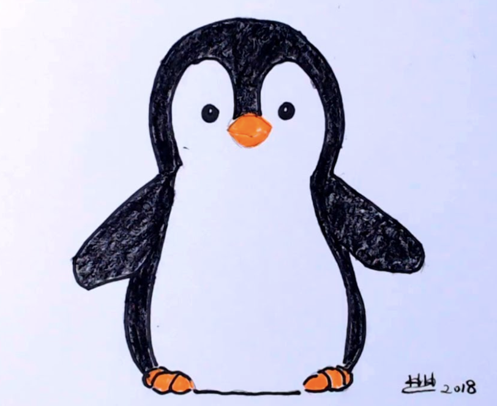

# Project Proposal

1. Roughly, what will your drawing look like
I am going to try to make a penguin. The image is not uploading right now but it is basically a head that has a widows peak, two dots for eyes and a beak (that is orange in the reference photo but I will likely do this project in black and white) + a body with a white belly and black outline with little ovals for feet.

3. What are two variables you could use so that when you change each variable, the drawing changes?
One of the variables could be the size of the head (and possibly details inside) and the other could be the size of the body (and possibly details inside).

4. Where is there repetition in your drawing?
The drawing is symmetrical, so I'm not sure if repetition can be used here but I assume there is a way to code some form of a mirror with a bisector or something so I hope to experiment with that. Some examples of repeated shapes are the arms/wings, feet, and eyes.

5. What are the main parts of your drawing? Are there clear sections or objects?
If this drawing were to be split into sections, I would say it could easily be separated between the head and the body, but if there should/need to be more sections, the body can also be split by the arms/middle section and feet/bottom section. the major parts are probably the outside shape meaning the circular head, arms, and oval body, but the details help make the drawing recognizable.

6. How could you use a loop variable of a for loop? Is there somewhere in your drawing where something is repeated, but it's slightly different each time? Maybe the same object is repeated in different places, or maybe a similar object is repeated but with different sizes?
Once again, like I mentioned in the repetition question, I think that a loop could possibly be used in terms of symmetry meaning just changing direction and coordinates while maintaining a definition/command. If a vertical line were to be drawn in the middle of the penguin and it were to be folded onto itself, it would be identical --> there are a lot of repeated shapes, so loops can definitly and will definitly be used.

